# Flutter ITI Movie App

    

This is a simple demo of a movie app, presented as a graduation project for a Flutter course from the Information Technology Institute (ITI).

The purpose of this project is to apply skills learned throughout the course by combining API integration, authentication, state management, local storage, cloud storage, and Git/GitHub in a Flutter movie application. The code follows an MVC-style structure with Provider-based state management and separate service and database layers.

## Features

- MVC-style architecture with Provider state management and service/database layers.
- Explore popular movies provided by The Movie Database (TMDB) API.
- Firebase account authentication.
- Saving movies to a "Favorite Movies" list.
- Searching locally loaded movies by title, overview, or release date.
- Keep track of how many movies the user watched, and how many are the user's favorite.

## Technologies Used

- Flutter SDK (Dart as a programming language)
- Firebase + Firestore
- SQFLite
- Android Studio + Android SDK + Android Emulator
- The Movie Database (TMDB) API

## File Architecture

The project uses an MVC-style organization supported by Provider, service classes, and database repositories, as follows:

    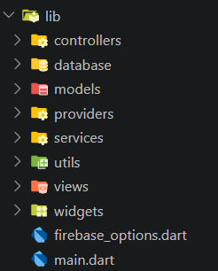

- **models/** ==> Movie models. 
- **views/** ==> Screens/pages and UI. 
- **controllers/** ==> Application logic and coordination between different layers. 
- **providers/** ==> Provider classes responsible for managing application state. 
- **services/** ==> API service, Firebase-related services, and cloud services. 
- **database/** ==> SQFLite database services and database operations. 
- **widgets/** ==> Reusable UI components. 
- **utils/** ==> Error handling, and theme classes.
- **firebase_options.dart** ==> Generated automatically by FlutterFire CLI.
- **main.dart** ==> Root of the application.

## Installation Instructions

### 1. Requirements

1) Flutter SDK + Dart
2) Android Studio + an Android emulator, or an Android device with USB debugging enabled
3) Node.js
4) Firebase + Firestore + A Firebase project with Email/Password Authentication and Cloud Firestore enabled
5) Visual Studio Code (VSCode)

### 2. App Installation and Running

1) Open the project root in Android Studio or Visual Studio Code.
2) Run `flutter clean`
3) Run `flutter pub get`.
4) Start an Android emulator, or connect a physical Android phone with USB debugging enabled.
5) Run `flutter run` or use Run and Debug.

## API Setup

- The TMDB API integration is implemented in **lib/services/movie_api_service.dart**.
- API Link: https://api.themoviedb.org/3
- The app currently loads popular movies and performs search locally against the loaded catalog; it does not call TMDB's search endpoint.
- For more information about TMDB, visit https://www.themoviedb.org/

## Firebase Setup

Firebase configuration files are already included for the configured project. Before running the app, make sure that:

1) Node.js is installed
2) Firebase CLI is installed (On Windows, make sure the installer file is inside the **C:\\** drive.)
3) Email/Password Authentication is enabled in Firebase Authentication.
4) Firestore cloud service is created and available in the configured Firebase project.
5) The project configuration files remain in **firebase.json** and **lib/firebase_options.dart**.

If you need to manage Firebase from the command line, install Node.js and the Firebase CLI from https://firebase.google.com/docs/cli/, then run `firebase login`. Deploy Firestore rules with `firebase deploy --only firestore` when appropriate.

## Screenshots

    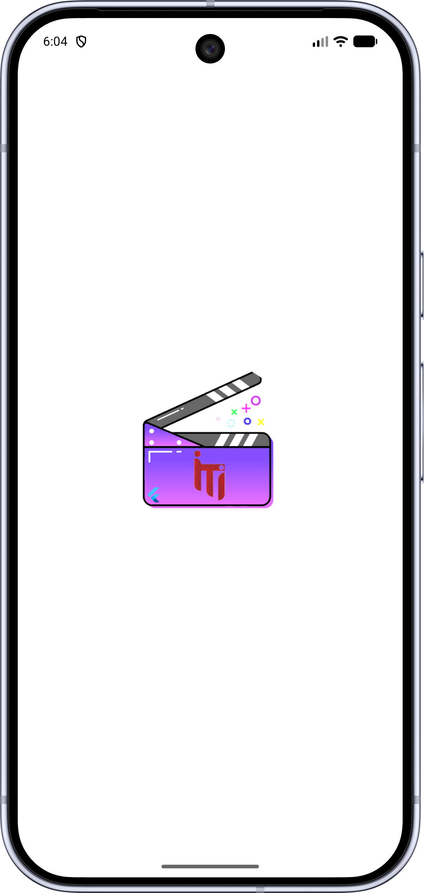
    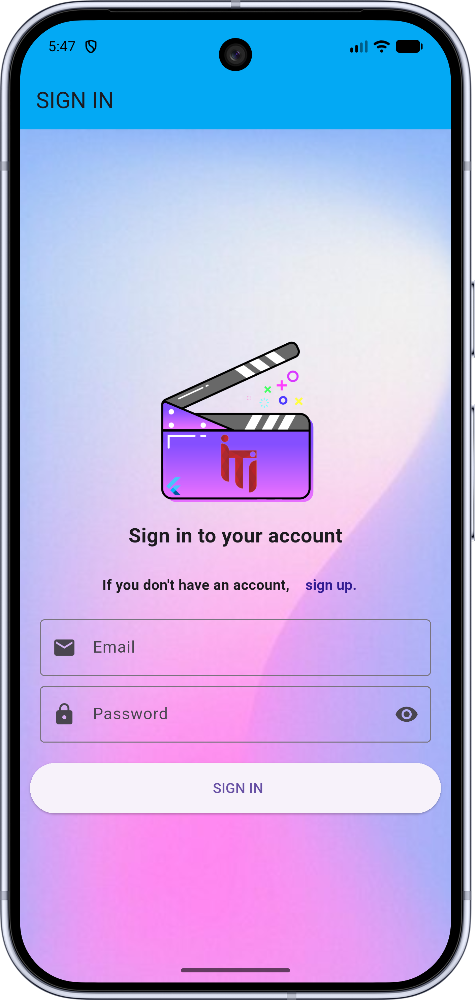
    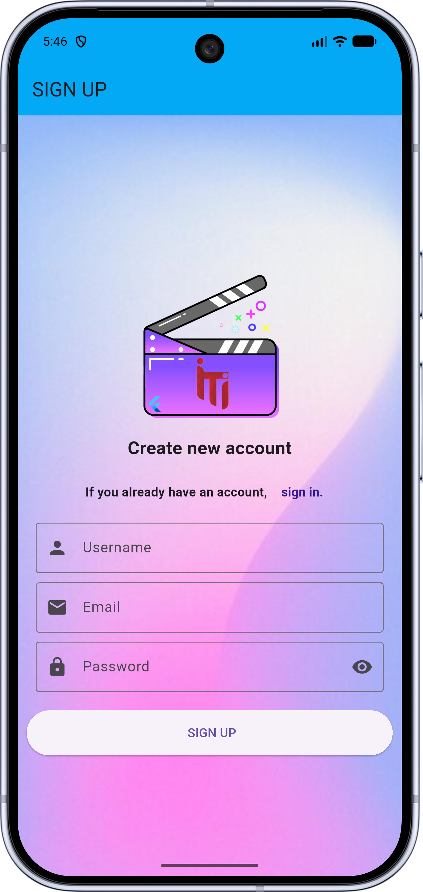
    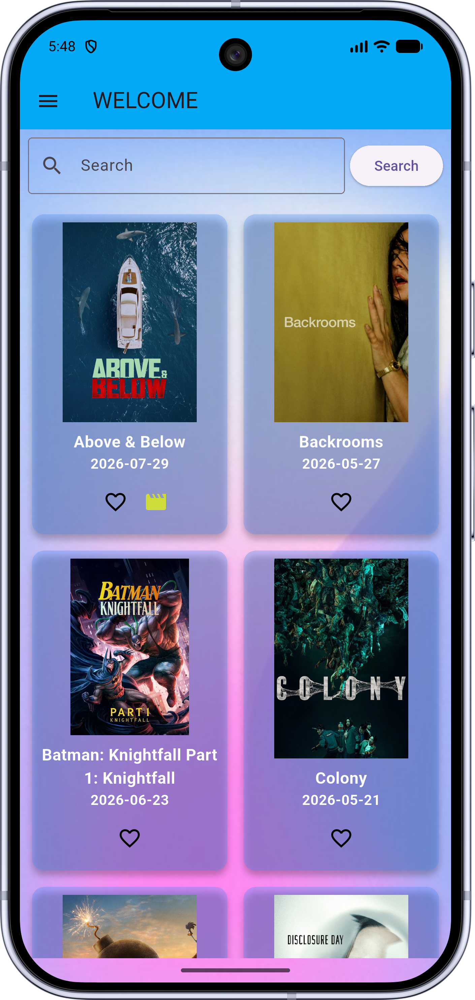
    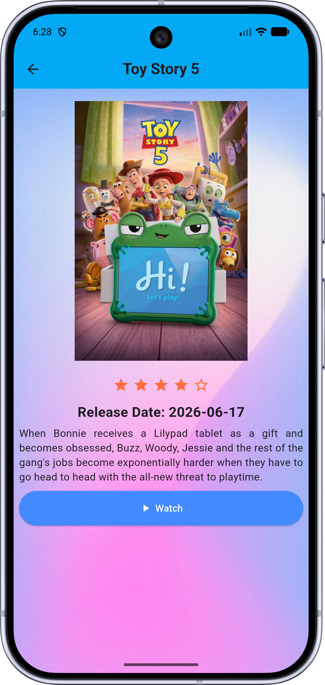
    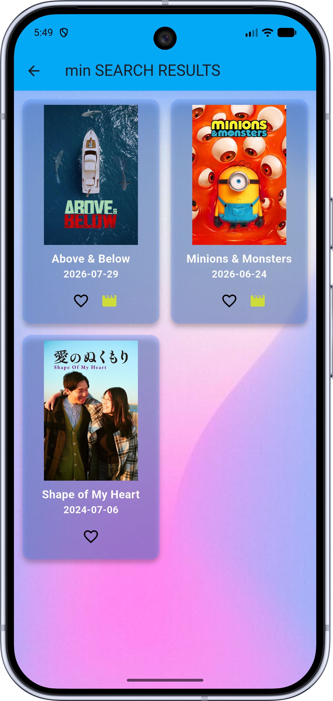
    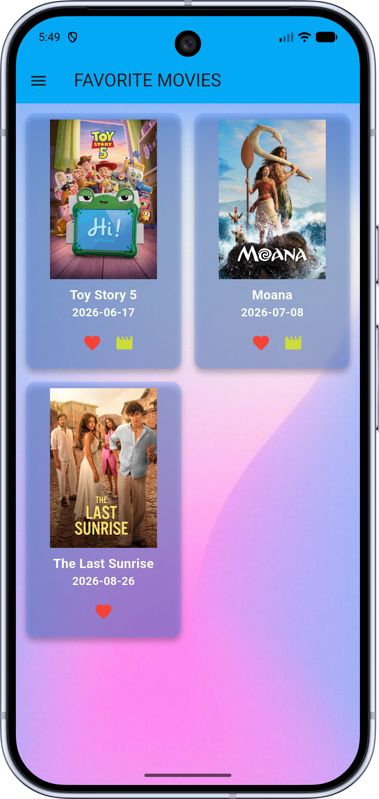
    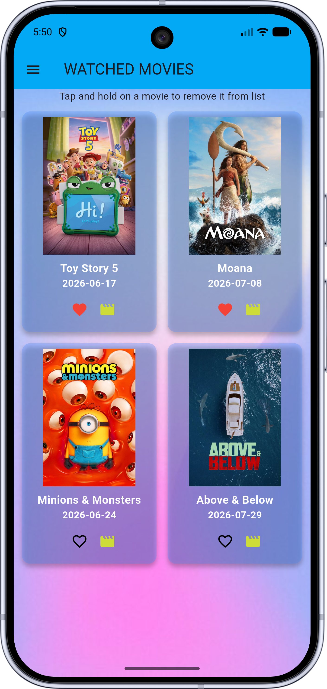
    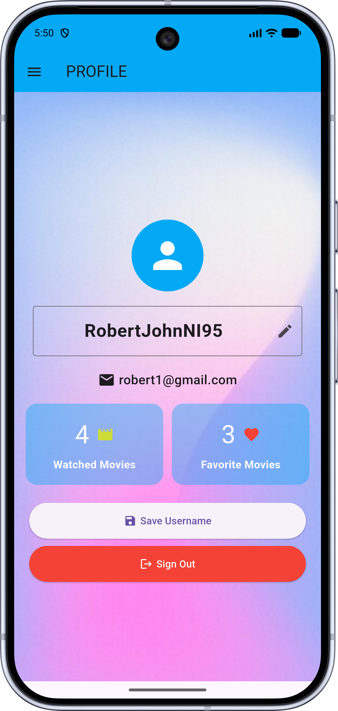
    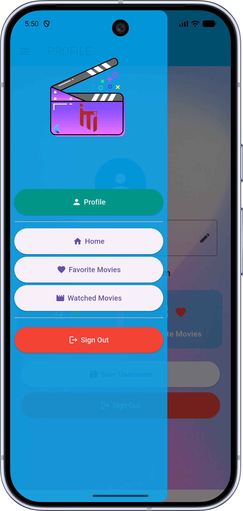

## Database

Inside the directory **lib/database/**, there are 3 database services:

    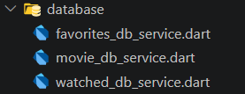

- **favorites_db_service.dart** ==> Contains and manages favorite movies for each user.
- **movie_db_service.dart** ==> Contains and manages all movies received using API.
- **watched_db_service.dart** ==> Contains and manages movies watched by each user.

## Application Flow

Splash Screen ==> Authentication (Sign In / Sign Up) ==> Home (All Popular Movies), with navigation to Search, Movie Details, Favorite Movies, Watched Movies, and Profile.

## Limitations

- The application may not work properly on iOS.
